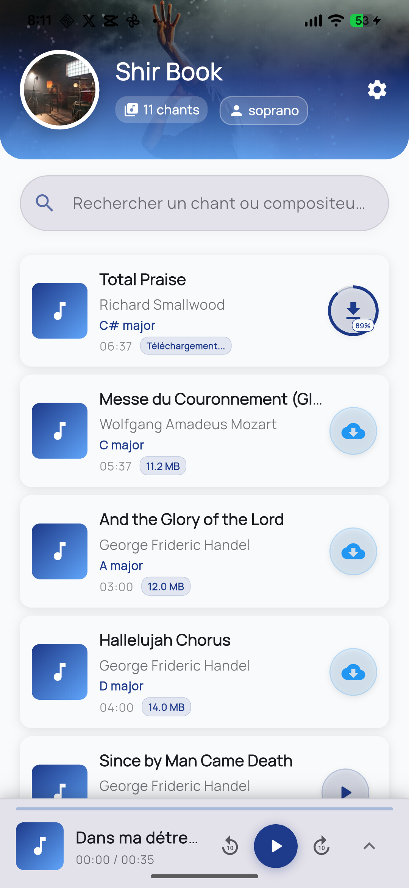
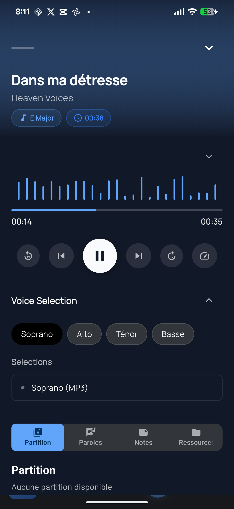
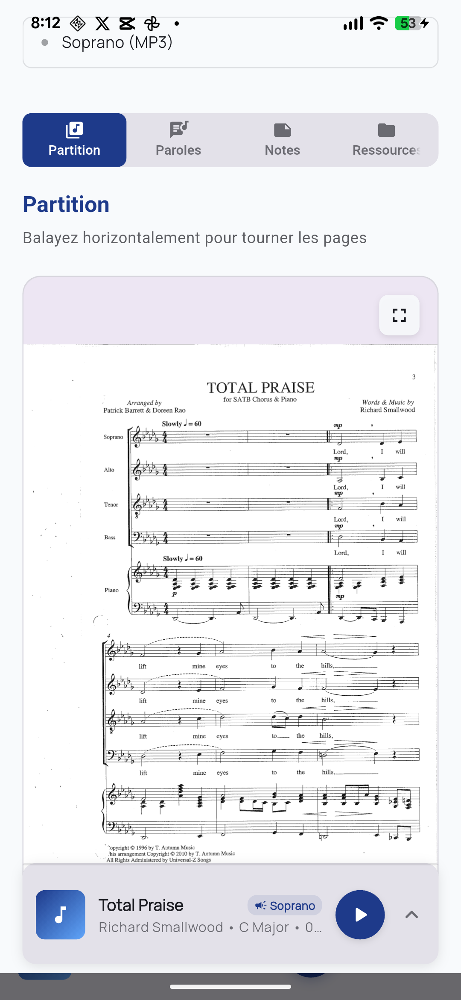

<div align="center">   <p>Made with 🎵 for choir

# ShirBook

<div align="center">   

​                                                                        *Un système d'apprentissage mobile pour chorales*

</div>

------

## Vision

ShirBook centralise les ressources musicales d'une chorale dans une application mobile. L'objectif est de permettre à chaque choriste d'accéder facilement à son répertoire et d'apprendre ses parties à son rythme, où qu'il soit.

Le projet privilégie la simplicité d'utilisation et le fonctionnement hors ligne pour s'adapter aux contraintes réelles des choristes amateurs : connexions limitées, niveaux techniques variés, et besoin d'accès rapide pendant les répétitions.

------

## Fonctionnalités

**Gestion du répertoire**

- Bibliothèque centralisée de tous les chants
- Recherche par titre, compositeur ou tonalité

**Ressources par chant**

- Audio isolé pour chaque pupitre (Soprano, Alto, Ténor, Basse)
- Support de multiples versions audio par pupitre
- Paroles avec phonétique pour langues étrangères
- Traductions des textes
- Notes spécifiques du maestro pour chaque pupitre
- Partitions PDF (si disponibles)
- Informations musicales (tonalité générale et par pupitre)

**Utilisation**

- Fonctionnement prioritairement hors ligne
- Téléchargement manuel des chants
- Mises à jour contrôlées par l'utilisateur
- Interface adaptée à tous les niveaux techniques

------

## 📱 Captures d'écran

<div align="center">          </div>


## Installation

### Testeurs

1. Télécharger l'APK : [lien de téléchargement](https://drive.google.com/file/d/1leqwwo7lQIA4mhqy5lKfiqFOXgkIpfu2/view?usp=drive_link)
2. Autoriser l'installation depuis sources inconnues
3. Installer l'application
4. Configurer son profil (nom et pupitre)
5. Télécharger les chants souhaités

### Prérequis

- Android 6.0 ou supérieur
- Espace de stockage : 100 MB minimum + espace pour les chants
- Connexion Internet (uniquement pour téléchargements initiaux et mises à jour)

------

## Architecture

### Technologies

**Frontend**

- Framework : Flutter
- Langage : Dart
- Stockage local : SQLite via sqflite
- Lecture audio : just_audio
- Visualisation PDF : flutter_pdfview

**Backend**

- Dépôt de données : GitHub ([shir-choir-data](https://github.com/main-c/shir-choir-data.git))
- Format de distribution : Packages compressés (.zip)
- Structure de données : JSON + fichiers binaires

### Principe de fonctionnement

**Organisation des données**

Chaque chant est distribué sous forme de package `.zip` contenant :

- `metadata.json` : Informations textuelles et références aux fichiers
- Dossier `audio/` : Fichiers audio pour chaque pupitre
- Dossier `partitions/` : Partitions PDF
- Structure permettant multiples audios par pupitre

**Flux de données**

1. L'application récupère le manifeste depuis GitHub
2. Le manifeste liste tous les chants disponibles avec leurs versions
3. Le choriste sélectionne les chants à télécharger
4. Les packages sont téléchargés et décompressés localement
5. Les métadonnées sont stockées en SQLite
6. Les fichiers audio et PDF restent en stockage interne
7. Les mises à jour sont notifiées mais téléchargées sur demande

**Stockage local**

```
Base SQLite :
- Table songs : métadonnées des chants téléchargés
- Table user_profile : pupitre et préférences
- Table learning_status : progression par chant

Système de fichiers :
/app_data/
  /songs/
    /song_id_1/
      /audio/
      /partitions/
```

------

## Structure du dépôt de données

Le dépôt [shir-choir-data](https://github.com/main-c/shir-choir-data.git) contient :

```
manifest.json                 # Liste des chants avec versions
song_id_1_v1.zip             # Package du chant 1
song_id_2_v1.zip             # Package du chant 2
...
```

**Format du manifeste :**

```json
{
  "chants": [
    {
      "id": "hallelujah_cohen",
      "titre": "Hallelujah",
      "version": 1,
      "derniere_mise_a_jour": "2025-09-07T10:00:00Z",
      "url_telechargement": "https://raw.githubusercontent.com/main-c/shir-choir-data/main/hallelujah_v1.zip"
    }
  ]
}
```

------

## Design

### Identité

- Nom : ShirBook (de "Shir" שיר - chant en hébreu)
- Couleur principale : Bleu nuit profond (#1E3A8A)
- Couleur secondaire : Bleu céleste (#60A5FA)
- Direction artistique : Spirituel et moderne

### Principes UX

- Offline-first : l'expérience ne dépend pas du réseau
- Contrôle utilisateur : pas de téléchargement automatique
- Clarté : information essentielle mise en avant
- Accessibilité : adapté à tous les âges

------

## Contribution

### Feedback

L'application est en phase de test. Vos retours sont essentiels pour améliorer l'expérience.

**Comment contribuer :**

- Tester toutes les fonctionnalités
- Remplir le formulaire de feedback
- Signaler les bugs avec captures d'écran
- Proposer des améliorations basées sur vos besoins réels

**Signaler un problème :**

- Ouvrir une [Issue](https://claude.ai/issues)
- Décrire le problème précisément
- Joindre des captures d'écran si pertinent
- Préciser le modèle de téléphone et version Android

------

## Évolution

### Version 1.0 (Actuelle - Test)

- Bibliothèque de chants avec statuts personnels
- Lecteur audio multi-pistes avec mixer
- Paroles, phonétique et traductions
- Notes du maestro par pupitre
- Visualisation des partitions
- Mode hors ligne
- Système de mise à jour contrôlée

### Version 1.1 (Prochaine)

- Améliorations UX basées sur retours testeurs
- Optimisation des performances de téléchargement
- Gestion intelligente de l'espace de stockage
- Recherche et filtres avancés
- Contrôle de tempo pour apprentissage progressif

### Version 2.0 (Future)

- Interface maestro pour création de packages
- Marqueurs de navigation dans les audios
- Export des statistiques pour le maestro
- Mode répétition avec boucle sur sections

Les évolutions futures sont guidées par les besoins réels exprimés par les utilisateurs. L'objectif reste de maintenir simplicité et efficacité.

------

## Licence

MIT License - Voir [LICENSE](https://claude.ai/chat/LICENSE)

------

## Équipe

Développé par Yannik pour faciliter l'apprentissage choral.

Contact : yannikkadjie@gmail.com

------

## Remerciements

Merci aux testeurs et choristes qui contribuent à améliorer ShirBook.

------

<div align="center">   <sub>Fait pour les chorales, partout dans le monde</sub> </div>

rs everywhere</p>   <p>     <a href="#-shirbook">Retour en haut</a>   </p> </div>
